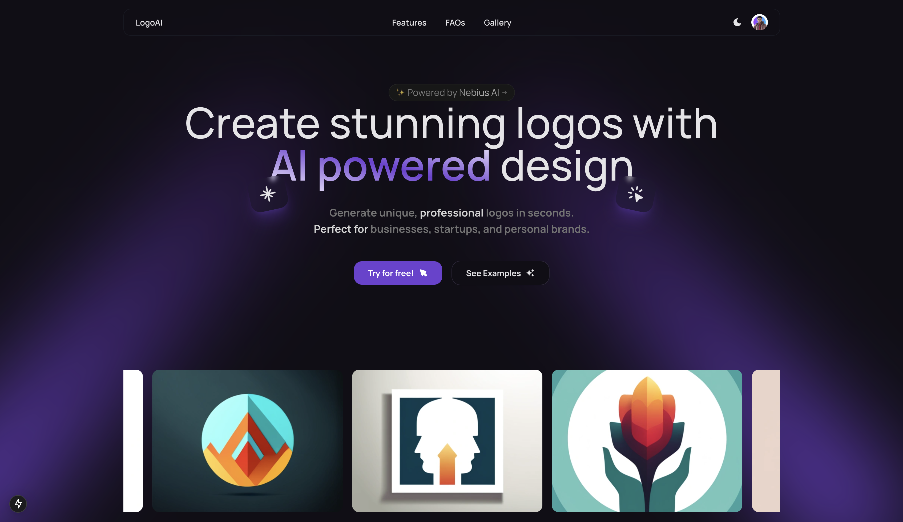

# LogoAI - AI-Powered Logo Generator



[LogoAI](https://www.logoai.in) is a modern web application that leverages artificial intelligence to generate unique, professional logos. Built with Next.js, TypeScript, and powered by Nebius AI, it offers a seamless experience for creating custom logos for businesses and personal brands.

## Features

- **AI-Powered Logo Generation**: Create unique logos using advanced AI models
- **Multiple AI Models**: Choose between different AI models including FLUX and Stability AI SDXL
- **Rate Limiting**: Limited to 10 logo generations per month per user
- **Customization Options**:
  - Multiple style presets (Minimal, Tech, Corporate, Creative, Abstract, Flashy)
  - Custom color selection
  - Various size options (256x256, 512x512, 1024x1024)
  - Quality settings (Standard, HD)
- **User History**: Track and manage previously generated logos
- **Public Gallery**: Browse logos created by other users
- **Secure Authentication**: User authentication powered by Clerk
- **Database Integration**: PostgreSQL with Drizzle ORM for reliable data storage

## Tech Stack

- **Frontend**: Next.js, TypeScript
- **Styling**: Tailwind CSS, Shadcn UI
- **Authentication**: Clerk
- **Database**: PostgreSQL (NeonDB)
- **Rate Limiting**: Upstash Redis
- **ORM**: Drizzle ORM
- **AI Integration**: Nebius AI
- **Animations**: Framer Motion
- **Analytics**: Umami
- **Deployment**: Vercel
- **Observibility**: Helicone

## Getting Started

### Prerequisites

Before you begin, you'll need to create accounts and obtain API keys from the following services:

- [Node.js 18+](https://nodejs.org/en/download/)
- [NeonDB Account](https://neon.tech/) - For PostgreSQL database
- [Nebius AI Account](https://dub.sh/nebius) - For AI model access
- [Clerk Account](https://clerk.com/) - For authentication
- [Vercel Account](https://vercel.com/) - For deployment
- [Upstash Account](https://upstash.com/) - For Ratelimiting
- [Helicone Account](https://www.helicone.ai/) - For Observability
- [Umami Account](https://umami.is/) - For Analytics

### Environment Variables

Create a `.env.local` file in the root directory with the following variables:

```env
# Database (from NeonDB)
POSTGRES_URL=your_postgres_connection_string

# AI (from Nebius AI Studio)
NEBIUS_API_KEY=your_nebius_api_key

# Auth (from Clerk Dashboard)
NEXT_PUBLIC_CLERK_PUBLISHABLE_KEY=your_clerk_publishable_key
CLERK_SECRET_KEY=your_clerk_secret_key

# Rate Limiting (from Upstash)
UPSTASH_REDIS_REST_URL=your_upstash_redis_url
UPSTASH_REDIS_REST_TOKEN=your_upstash_redis_token

# Observability (from Helicone)
HELICONE_API_KEY=your_helicone_api_key

# Development
NEXT_PUBLIC_DEVELOPMENT_URL=http://localhost:3000
```

### Installation

1. Clone the repository:

```bash
git clone https://github.com/Arindam200/logo-ai.git
cd logo-ai
```

2. Install dependencies:

```bash
npm install
# or
yarn install
```

3. Run database migrations:

```bash
npm run db:migrate
# or
yarn db:migrate
```

4. Start the development server:

```bash
npm run dev
# or
yarn dev
```

5. Open [http://localhost:3000](http://localhost:3000) with your browser to see the result.

### Docker Deployment

1. Build the Docker Compose image:

```bash
# Start all services in detached mode
docker compose up -d --build

# Check logs
docker compose logs -f app

# Check http://localhost:3000
```

2. Or, build the Docker image and run the container:

```bash
# 1. Build the Docker image
docker build -t logoai .

# 2. Run the container
docker run -p 3000:3000 \
  -e NEBIUS_API_KEY=$NEBIUS_API_KEY \
  -e NEXT_PUBLIC_CLERK_PUBLISHABLE_KEY=$NEXT_PUBLIC_CLERK_PUBLISHABLE_KEY \
  -e CLERK_SECRET_KEY=$CLERK_SECRET_KEY \
  logoai

# Check http://localhost:3000
```

## Project Structure

```
├── app/
│   ├── actions/        # Server actions
│   ├── gallery/        # Public gallery page
│   ├── generate/       # Logo generation page
│   ├── history/        # User history page
│   └── page.tsx        # Landing page
├── components/         # UI components
├── db/
│   ├── index.ts        # Database configuration
│   └── schema.ts       # Database schema
├── lib/
│   ├── domain.ts       # Domain configuration
│   └── upstash.ts      # Rate limiting configuration
├── public/            # Static assets
└── middleware.ts      # Rate limiting middleware
```

## Contributing

Contributions are welcome! Please feel free to submit a Pull Request.

## License

This project is licensed under the MIT License - see the [LICENSE](LICENSE) file for details.

## Acknowledgments

Special thanks to:

- [Nebius AI](https://dub.sh/nebius) for powering our logo generation with their cutting-edge AI models and generous free credits
- [Aman Bairagi](https://github.com/amanbairagi30) for his contributions to the UI design.

## Support

For support, please open an issue in the GitHub repository or contact the maintainers.
